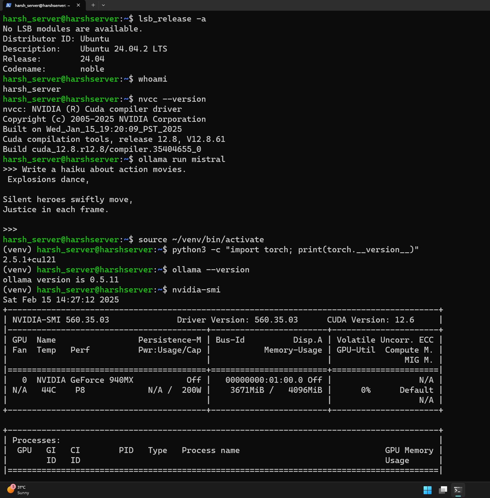

Welcome to my GitHub repository, where I maintain a collection of useful scripts and markdown files. These include various utilities and instructions designed to enhance productivity and streamline various tasks.

## Repository Contents

- **[TensorFlow and PyTorch GPU Environment Setup](tf_pytorch_gpu_env_setup.md)** - Instructions and scripts for setting up a GPU-accelerated environment for TensorFlow and PyTorch.
- **[YouTube Downloader](yt_downloader)** - A script for downloading videos from YouTube.
- **[GRUB Modifier](GRUB_modify.md)** - Guide and scripts for modifying the GRUB bootloader.
- **[Mount Internal HDD in Ubuntu](mount_internal_hdd_ubuntu.md)** - Step-by-step guide on how to mount an internal HDD in Ubuntu.
- **[Password Generator](password_gen.py)** - A Python script for generating secure passwords.
- **[Password Strength Checker](password_strength_check.py)** - A utility to check the strength of your passwords.
- **[Pixel Fixer](pixel_fixer.html)** - A simple HTML tool to help fix stuck pixels on displays.
- **[Remove Image Metadata](remove_image_metadata.py)** - Script to strip metadata from images for privacy.
- **[Rename Files Across Folders](rename_files_across_folder.py)** - A Python script to batch rename files across multiple folders.
- **[Selenium Guide](selenium.md)** - A markdown guide for automated web actions using Selenium.
- **[HEIC to JPEG Converter](heic_to_jpeg.py)** - Convert HEIC image files to JPEG format.

---

