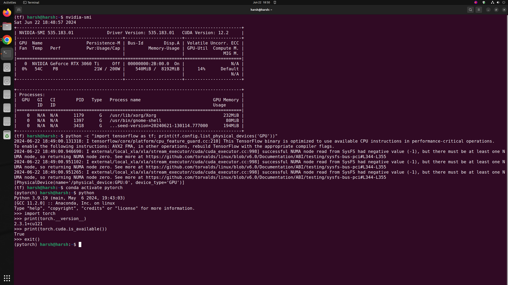

# Environment Setup for TensorFlow with CUDA and cuDNN

This guide will help you set up your environment to use TensorFlow with CUDA and cuDNN on a Linux system.
Works with Ubuntu 22.04 and 24.04 [I have tested it]



## Prerequisites

1. Ensure you have a compatible NVIDIA GPU.
2. Install the required NVIDIA drivers.

## Useful Links

- [CUDA and cuDNN Installation Guide](https://www.tensorflow.org/install/source#gpu_support_2)
- [TensorRT Support for TensorFlow 2.16.1](https://github.com/tensorflow/tensorflow/issues/61468)

## Step-by-Step Installation

### Update and Upgrade System Packages

```sh
sudo apt update
sudo apt upgrade
sudo apt install build-essential
```

### Install Anaconda

[https://docs.anaconda.com/anaconda/install/linux/](https://docs.anaconda.com/anaconda/install/linux/)
```sh
curl -O https://repo.anaconda.com/archive/Anaconda3-2024.02-1-Linux-x86_64.sh
bash ~/Downloads/Anaconda3-2024.02-1-Linux-x86_64.sh
```

### Install CUDA

[CUDA Toolkit 12.1 Update 1 Downloads - Run File Local for Ubuntu 22.04 x86_64](https://developer.nvidia.com/cuda-12-1-1-download-archive?target_os=Linux&target_arch=x86_64&Distribution=Ubuntu&target_version=22.04&target_type=runfile_local)
```sh
wget https://developer.download.nvidia.com/compute/cuda/12.1.1/local_installers/cuda_12.1.1_530.30.02_linux.run
sudo sh cuda_12.1.1_530.30.02_linux.run
[Do not install the Nvidia Drivers, Press ENTER to deselect.]
```

#### Update Environment Variables

Open the `.bashrc` file:

```sh
nano ~/.bashrc
```

Add the following lines at the end of the file:

```sh
export PATH=/usr/local/cuda-12.1/bin${PATH:+:${PATH}}
export LD_LIBRARY_PATH=/usr/local/cuda-12.1/lib64${LD_LIBRARY_PATH:+:${LD_LIBRARY_PATH}}
```

Source the updated `.bashrc` file:

```sh
source ~/.bashrc
```

#### Update Library Configuration

Open the library configuration file:

```sh
sudo nano /etc/ld.so.conf
```

Add the following line:

```sh
/usr/local/cuda-12.1/lib64
```

Run the `ldconfig` command to update the library cache:

```sh
sudo ldconfig
```

#### Verify CUDA Installation

Check the CUDA installation by running the following commands:

```sh
echo $PATH
echo $LD_LIBRARY_PATH
sudo ldconfig -p | grep cuda
nvcc --version
```

### Install cuDNN

Download cuDNN from the [NVIDIA cuDNN Archive](https://developer.nvidia.com/rdp/cudnn-archive).

Extract the downloaded tar file:

```sh
tar -xvf cudnn-linux-x86_64-8.9.7.29_cuda12-archive.tar.xz
cd cudnn-linux-x86_64-8.9.7.29_cuda12-archive
```

Copy the necessary files to CUDA directories:

```sh
sudo cp include/cudnn*.h /usr/local/cuda-12.1/include
sudo cp lib/libcudnn* /usr/local/cuda-12.1/lib64
sudo chmod a+r /usr/local/cuda-12.1/include/cudnn*.h /usr/local/cuda-12.1/lib64/libcudnn*
```

Verify the installation:

```sh
ls -l /usr/local/cuda-12.1/lib64/libcudnn*
```

#### Test cuDNN

Create a test file `test_cudnn.c`:

```c
#include <cudnn.h>
#include <stdio.h>

int main() {
    cudnnHandle_t handle;
    cudnnStatus_t status = cudnnCreate(&handle);
    if (status == CUDNN_STATUS_SUCCESS) {
        printf("cuDNN successfully initialized.\n");
    } else {
        printf("cuDNN initialization failed.\n");
    }
    cudnnDestroy(handle);
    return 0;
}
```

Compile and run the test file:

```sh
gcc -o test_cudnn test_cudnn.c -I/usr/local/cuda-12.1/include -L/usr/local/cuda-12.1/lib64 -lcudnn
./test_cudnn
```

### Install TensorRT

Download TensorRT from the [NVIDIA TensorRT Download](https://developer.nvidia.com/tensorrt/download)  
[nvidia-tensorrt-8x-download](https://developer.nvidia.com/nvidia-tensorrt-8x-download)  
TensorRT 8.6 GA for x86_64 Architecture  
[TensorRT 8.6 GA for Linux x86_64 and CUDA 12.0 and 12.1 TAR Package](https://developer.nvidia.com/downloads/compute/machine-learning/tensorrt/secure/8.6.1/tars/TensorRT-8.6.1.6.Linux.x86_64-gnu.cuda-12.0.tar.gz)  
```sh
tar -xzvf TensorRT-8.6.1.6.Linux.x86_64-gnu.cuda-12.0.tar.gz
sudo mv TensorRT-8.6.1.6 /usr/local/TensorRT-8.6.1
```

#### Update Environment Variables

Open the `.bashrc` file:

```sh
nano ~/.bashrc
```

Add the following lines at the end of the file:

```sh
export PATH=/usr/local/cuda-12.1/bin:/usr/local/TensorRT-8.6.1/bin:$PATH
export LD_LIBRARY_PATH=/usr/local/cuda-12.1/lib64:/usr/local/TensorRT-8.6.1/lib:$LD_LIBRARY_PATH
```

Source the updated `.bashrc` file:

```sh
source ~/.bashrc
```

Update the library cache:

```sh
sudo ldconfig
```

Remove old cuDNN symbolic links and create new ones:

```sh
sudo rm /usr/local/cuda-12.1/targets/x86_64-linux/lib/libcudnn*.so.8
sudo ln -s /usr/local/cuda-12.1/targets/x86_64-linux/lib/libcudnn_adv_infer.so.8.x.x /usr/local/cuda-12.1/targets/x86_64-linux/lib/libcudnn_adv_infer.so.8
```

### Set Up TensorFlow Environment

Create and activate a new conda environment:

```sh
conda create --name tf python=3.9
conda activate tf
```

Install TensorFlow with GPU support:

```sh
pip install tensorflow[and-cuda]
```

Verify TensorFlow installation:

```sh
python -c "import tensorflow as tf; print(tf.config.list_physical_devices('GPU'))"
```

### Install TensorRT Python Packages

Navigate to the TensorRT Python directory:

```sh
cd /usr/local/TensorRT-8.6.1/python
```

Install the necessary packages:

```sh
[Make sure to be in a conda environment before running the below 3 commands]
conda activate tf
pip install tensorrt-8.6.1-cp39-none-linux_x86_64.whl
pip install tensorrt_dispatch-8.6.1-cp39-none-linux_x86_64.whl
pip install tensorrt_lean-8.6.1-cp39-none-linux_x86_64.whl
```

### Install JupyterLab

Install JupyterLab for interactive development:

```sh
pip install jupyterlab
jupyter lab
```

Now, you have a complete environment set up with TensorFlow, CUDA, cuDNN, and TensorRT on your Linux system.

# PyTorch Installation Guide

Install PyTorch in a separate conda environment on a Linux system.

## Prerequisites

1. Ensure you have a compatible NVIDIA GPU if you plan to use CUDA.
2. Install the required NVIDIA drivers.

## Reference

For more detailed instructions and options, visit the official [PyTorch Installation Guide](https://pytorch.org/get-started/locally/).

## Step-by-Step Installation

### Create and Activate Conda Environment

First, create a new conda environment named `pytorch` with Python 3.9:

```sh
conda create --name pytorch python=3.9
```

Activate the newly created environment:

```sh
conda activate pytorch
```

### Install PyTorch

Install PyTorch along with torchvision and torchaudio using pip and specify the CUDA version you want to use. In this example, we are using CUDA 12.1:

```sh
pip3 install torch torchvision torchaudio --index-url https://download.pytorch.org/whl/cu121
```

### Verify Installation

To verify that PyTorch is installed correctly and CUDA is enabled, run the following Python commands:

```python
import torch
print(torch.__version__)
print(torch.cuda.is_available())
```

If CUDA is available, it should return `True`.
